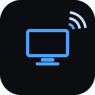

<div align="center">



# Pult

**Control your computer from your phone — live screen, real keyboard and mouse.**

No account, no cloud, no third-party server. Your phone talks to your PC directly.

</div>

---

## What it is

Pult turns any phone into a full remote control for your computer. Open a link,
and you get your desktop streaming live at 30–60 fps with a trackpad, a real
keyboard, and system controls. It runs quietly in the tray — no terminal window,
no visible process.

It is built for the case where existing tools are more than you need: you don't
want to create an account somewhere, you don't want your screen going through
someone else's relay, and you'd rather have something small you can read the
source of.

## How it works

```
   ┌──────────────────────────────┐
   │  PC agent (tray, no console) │
   │                              │
   │  screen ──► ffmpeg ──► H.264 │
   │  input  ◄── SendInput        │
   └────────────┬─────────────────┘
                │  HTTPS + WebSocket
                │
   ┌────────────▼─────────────────┐
   │  Phone (web app / PWA)       │
   │  H.264 ──► WebCodecs ──► screen
   │  touch  ──► mouse + keyboard │
   └──────────────────────────────┘
```

The screen is captured with the GPU (Desktop Duplication API), encoded to H.264
by the GPU encoder, and sent over a WebSocket. The phone decodes it with
**WebCodecs**, which hands the stream to the phone's hardware decoder. That is
why it stays smooth without draining the battery.

On an NVIDIA GTX 1650 capturing 1080p at 30 fps, the agent uses about **3% CPU**.

## Features

- **Live screen** — H.264, 15–60 fps, adjustable quality, multi-monitor
- **Real input** — absolute and trackpad pointer modes, full keyboard, scroll,
  drag, right-click, middle-click, back/forward buttons
- **Any keyboard layout** — text is injected as Unicode, so Uzbek, Russian,
  emoji all work regardless of the layout set on the PC
- **System commands** — lock, sleep, shut down, turn the display off, launch
  a program
- **Hardware encoder auto-detection** — NVENC → Quick Sync → AMF → Media
  Foundation → x264 fallback, so it works on any machine
- **Idle-quiet** — capture only runs while someone is watching; nothing is
  encoded when the app is closed
- **Installable** — add to home screen and it opens like a native app

## Gestures

Two pointer modes, switchable from the toolbar.

**Trackpad** — the phone behaves like a laptop touchpad; the cursor moves
relative to your finger. **Direct** — you tap where you want to click.

| Gesture | Action |
| --- | --- |
| One finger drag | Move the cursor |
| Tap | Left click |
| Double tap | Double click |
| **Press and hold ~0.8 s, then move** | **Grab and drag — the reliable way** |
| Double tap, then hold and move | Drag (trackpad idiom, if you prefer it) |
| Two-finger tap | Right click |
| Long press (direct mode) | Right click |
| Two-finger drag | Scroll (either axis when the view is rotated) |
| The 2× button | Double click, when tapping twice is fiddly |
| Pinch | Zoom the view, then drag to pan |
| **Three-finger swipe left/right** | **Switch windows — Alt held down, follows the swipe** |
| Three-finger swipe up | Task View |
| Three-finger swipe down | Show desktop |
| Swipe the black band above the picture | Switch monitors (buttons are easier) |

### Several monitors

With more than one screen, the toolbar carries a numbered button per monitor
instead of the left/right click buttons — those are redundant anyway, since a
tap is a left click and a two-finger tap is a right click. Screens are numbered
the way they physically sit on your desk, not by their system numbers, so "2"
is the one actually on the right.

You can also swipe the black band above the picture to move between screens,
though on a phone that band can be under 20 pixels tall and is easy to miss —
the buttons are the reliable way.

Move the cursor past the edge of one screen and it crosses to the next, and the
view follows it — so the cursor is never on a screen you cannot see. This
matters because in trackpad mode a click carries no coordinates: it lands
wherever the cursor happens to be, and a cursor left behind on another monitor
means clicking blind. If you would rather keep the pointer on one screen, turn
off *Kursor ekranlar orasida yursin* and it stays put.

**If the video shows one screen while the mouse moves on another**, press
*Ekranlar almashib qolgan* in the settings. Screen capture numbers monitors in
the graphics adapter's output order, which is not something the system exposes;
Pult orders them by device number (`\.\DISPLAY1`, `DISPLAY2`, …), which is
usually right but cannot be guaranteed. The button rotates the mapping and
saves it.

## Fitting a desktop onto a phone

A 16:9 desktop shown upright on a portrait phone becomes a thin strip — small
enough that text is unreadable. So the view rotates: when the phone is
portrait, the desktop is turned sideways and fills the screen. On a 375-wide
phone that is 78% larger than the upright fit. Rotation is automatic, and the
⟲ button cycles upright → left → right if you prefer to turn the phone the
other way. ⛶ goes fullscreen and asks the browser to lock landscape.

Pinch to zoom up to 8×, then drag with two fingers to pan; the scale indicator
in the top bar resets it. Taps stay accurate at any rotation and zoom because
the pointer mapping is computed from the view transform rather than read back
from the element's bounding box — a rotated element's bounding box is its outer
rectangle, which would put every click in the wrong place.

The window switcher works the way a laptop trackpad does: Alt is pressed and
stays down while your fingers are on the screen, so the switcher panel remains
open and moves with the swipe. It commits when you lift your fingers. Should
the connection drop mid-gesture, the host releases every key that session was
holding — a stuck Alt would otherwise make the computer unusable.

Dragging has two ways in because the trackpad idiom — double tap, keep the
second tap down, then move — turns out to be hard to perform on glass. Pressing
and holding for about 0.8 s grabs whatever is under the pointer, a green ring
follows your finger while you hold it, and lifting drops it. Anything shorter
than the hold is an ordinary click, so there is no duration that does nothing.

Two details that matter more than they look. The second tap of a double click
is sent at the **first tap's** position, because a finger never lands twice on
exactly the same pixel and Windows only counts two clicks as a double click if
they are close enough together. And a second tap does not immediately begin a
drag — the decision waits ~320 ms: lift quickly and it is a double click, keep
holding and it becomes a drag.

## Requirements

- Windows 10/11 (Linux and macOS backends are stubbed, not finished)
- Python 3.10+
- [ffmpeg](https://ffmpeg.org/download.html) on `PATH`
- A phone with Chrome (Android) or Safari on iOS 17+

## Install

```bash
git clone https://github.com/<you>/pult
cd pult
pip install -r requirements.txt
python tests/selftest.py        # verify it works on your machine
```

Start it:

```bash
pythonw -m pult                 # tray, no console window
python -m pult --console        # with logs in the terminal
```

Right-click the tray icon → **Telefonni ulash (QR)** → scan the code with your
phone.

### Build a standalone `.exe`

```bash
python scripts/build.py                 # dist/Pult.exe, ~20 MB
python scripts/build.py --with-ffmpeg   # bundle ffmpeg too, ~100 MB
```

The result is a single file with no console window. Python is not required on
the machine that runs it.

### Get a message when the computer comes online

Create a bot with [@BotFather](https://t.me/BotFather), then:

```bash
python -m pult --telegram <BOT_TOKEN>
```

Send `/start` to your bot and the agent picks up the chat id by itself — you
never have to look it up. From then on, every time the machine boots and
reaches the internet, you get a message with the link.

```bash
python -m pult --test-notify    # send one now to check
```

### Start automatically at login

```powershell
powershell -ExecutionPolicy Bypass -File scripts\autostart.ps1
powershell -ExecutionPolicy Bypass -File scripts\autostart.ps1 -Remove
```

This registers a Task Scheduler entry that runs **at logon**, as your own user.
That is deliberate and not an oversight: on Windows, injecting mouse and
keyboard events requires running inside the interactive user session. Installed
as a service it would sit in session 0 and be unable to touch the desktop at
all — a common way to get this wrong.

## Why HTTPS with a self-signed certificate

Browsers only expose video decoding (WebCodecs), service workers and wake-lock
in a **secure context**. `localhost` counts; a LAN address over plain HTTP does
not. Serving `http://192.168.x.x` leaves `VideoDecoder` undefined and nothing
renders.

So the agent generates a self-signed certificate on first run and serves HTTPS.
Your phone shows a warning once — **Advanced → Proceed** — and after that the
page is a secure context and everything works. The certificate is stored in the
config directory and regenerated automatically if your LAN address changes.

If you put the agent behind a tunnel that terminates TLS for you (Cloudflare
Tunnel, Tailscale Serve, a reverse proxy), set `"tls": "off"` in the config and
let the tunnel provide the real certificate — then there is no warning at all.

## Security

The link contains a token that grants **full control of the machine**. Treat it
like a password.

- Every connection must present the token; there is no anonymous access
- Tokens are compared in constant time
- `/api/info` returns only the machine name without a token, so a phone can see
  which of its saved computers are online without exposing anything else
- Keyboard and mouse injection (`security.allow_input`) and system commands
  (`security.allow_commands`) can each be disabled in the config
- To revoke access, delete `token` from the config and restart — a new one is
  generated

Do not expose the port straight to the internet. Use a tunnel with its own
authentication in front of it.

## Configuration

`%APPDATA%\Pult\config.json` on Windows, `~/.config/pult/config.json` elsewhere.

**Portable mode:** create a folder named `data` next to the program and Pult
will keep everything there instead. Besides USB installs, this solves a real
problem: if the agent is launched in different ways — from a shell, from Task
Scheduler, from inside another application — the OS may hand each one a
different `AppData`, and you end up with two configs and two different tokens,
so the link on your phone stops working. A fixed `data` folder removes the
ambiguity. `PULT_CONFIG_DIR` overrides both.

The config directory in use is written to the log on every start.

```jsonc
{
  "host_name": "workstation",
  "port": 8787,
  "tls": "auto",              // "off" behind a TLS-terminating tunnel
  "stream": {
    "monitor": 0,
    "fps": 30,
    "width": 1280,            // 0 = native resolution
    "bitrate_kbps": 4000,
    "cursor": true,
    "encoder": null           // null = auto-detect
  },
  "security": { "allow_input": true, "allow_commands": true }
}
```

## Project layout

```
pult/
├── platform/      OS-specific: input injection, screen capture, system commands
├── host/          server, session protocol, pairing page
├── capture.py     ffmpeg process, H.264 access-unit splitting
├── config.py      settings
├── tls.py         self-signed certificate
└── tray.py        tray icon, background mode
web/               phone app (PWA)
tests/selftest.py  end-to-end verification
```

The protocol is transport-agnostic on purpose: a *controller* is anything that
speaks it — the phone, another program, or an AI agent. Adding a new kind of
client does not require touching the host.

## Roadmap

- [x] Telegram notification when the machine comes online
- [x] Single `.exe` build (PyInstaller), so Python is not required
- [x] Start at login
- [ ] Tunnel support — a real certificate and access from anywhere
- [ ] Hub mode — one phone, several computers, no port forwarding on either end
- [ ] Android APK wrapper around the web app
- [ ] AI controller — describe what you want, it drives the machine
- [ ] Linux and macOS capture/input backends
- [ ] UI translations (the phone interface is currently Uzbek)

## License

MIT
